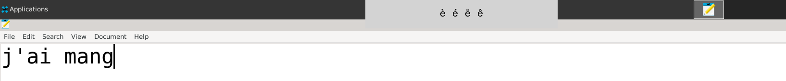

# Quick Accent App

## Overview

The Quick Accent App is a simple Python application that provides an easy way to type accented characters using a keyboard shortcut. It utilizes the `tkinter` library for the graphical user interface and the `pynput` library to listen for keyboard events. When a user presses a specific key, a small window appears, allowing them to select the desired accented character.

## Features

- Displays a selection of accented characters based on the key pressed.
- Allows users to navigate through the available accents using the spacebar.
- Automatically types the selected accent into the active text field.
- Lightweight and runs in the background.

## Requirements

- Python 3.x
- `tkinter` (usually included with Python installations)
- `pynput` library

You can install the `pynput` library using pip:

```bash
pip install pynput
```

## Usage

1. Run the application by executing the script:

   ```bash
   python quickaccent.py
   ```
2. Press one of the following keys to display the corresponding accented characters:
- `a` for `àâ`
- `e` for `èéëê`
- `i` for `ïî`
- `o` for `ô`
- `u` for `ùüû`
- `c` for `ç`

3. Use the spacebar to navigate through the available accents.
4. Press the spacebar again to select the highlighted accent, which will be typed into the active text field.


